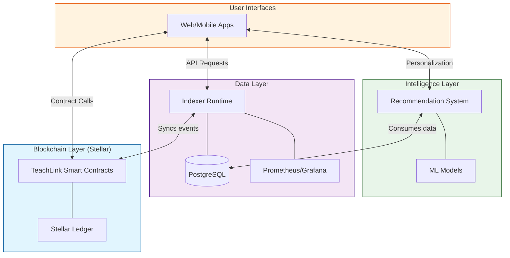

# TeachLink System Overview

Welcome to the **TeachLink** ecosystem—a decentralized knowledge-sharing platform powered by the Stellar network. This document provides a high-level overview of the entire system architecture, integrating blockchain smart contracts, real-time data indexing, and machine learning-driven recommendations.

---

## 🏗️ The Three Pillars

The TeachLink platform is built on three foundational pillars that work in harmony to deliver a seamless decentralized learning experience.

### 1. Blockchain Core (Soroban Smart Contracts)
The heart of TeachLink resides on the Stellar network. Our smart contracts, written in Rust for the Soroban platform, handle all critical business logic with transparency and security.
- **Key Features:** Cross-chain bridging, BFT consensus, multi-sig escrow, content tokenization (NFTs), and decentralized reputation scoring.
- **Location:** `contracts/`
- **Documentation:** [Architecture Details](docs/ARCHITECTURE.md) | [API Reference](docs/API_REFERENCE.md)

### 2. Data Availability Layer (Indexer Runtime)
To provide a fast and responsive user experience, TeachLink employs a high-performance indexer that monitors the Stellar blockchain in real-time.
- **Tech Stack:** TypeScript, NestJS, PostgreSQL, Prometheus.
- **Key Features:** Event processing, historical data archival, and a robust REST API for client applications.
- **Location:** `indexer/`
- **Documentation:** [Indexer Implementation](indexer/IMPLEMENTATION.md) | [Monitoring Guide](indexer/MONITORING.md)

### 3. Intelligence Layer (Recommendation System)
TeachLink leverages machine learning to personalize the learning journey for every user, ensuring high engagement and effective knowledge transfer.
- **Tech Stack:** Python, TensorFlow/PyTorch, Scikit-learn.
- **Key Features:** Content discovery, personalized learning paths, and predictive reputation modeling.
- **Location:** `recommendation-system/`
- **Documentation:** [ML Architecture](recommendation-system/ARCHITECTURE.md) | [Implementation Guide](recommendation-system/IMPLEMENTATION_GUIDE.md)

---

## 🗺️ Global System Map

The following diagram illustrates how the three pillars interact to form the complete TeachLink ecosystem.

---

## 🛠️ Technology Stack

| Layer | Technologies |
| :--- | :--- |
| **Smart Contracts** | Rust, Soroban SDK, Stellar CLI |
| **Indexer/Backend** | TypeScript, NestJS, TypeORM, PostgreSQL |
| **Machine Learning** | Python, Pandas, NumPy, Scikit-learn |
| **DevOps** | Docker, GitHub Actions, Prometheus, Grafana |
| **Testing** | Cargo Test, Jest, Property-based Testing |

---

## 🚀 Getting Started

If you are a developer looking to contribute or deploy the system, follow these links:

1.  **Environment Setup:** See the [Onboarding section in README](README.md#onboarding).
2.  **Contract Development:** Explore the [Developer Experience Toolkit](DEVELOPER_EXPERIENCE.md).
3.  **Indexing & Monitoring:** Check the [Observability Guide](OBSERVABILITY.md).
4.  **Contribution:** Read our [Contributing Guidelines](CONTRIBUTING.md).

---

## 📜 Repository Health & Safety

- **Security:** Our security protocols are documented in [SECURITY.md](SECURITY.md).
- **Incident Response:** See [INCIDENT_RESPONSE.md](INCIDENT_RESPONSE.md) for emergency procedures.
- **Testing:** We maintain high standards with our [Testing Platform](TESTING_PLATFORM.md).

---

  
Built with ❤️ by the TeachLink Team

