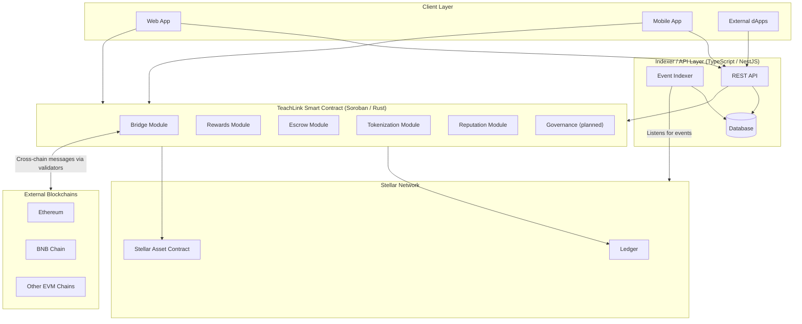
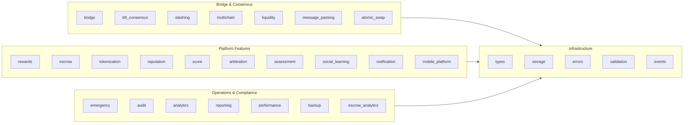
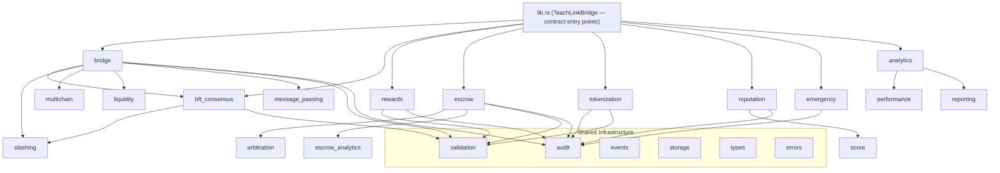
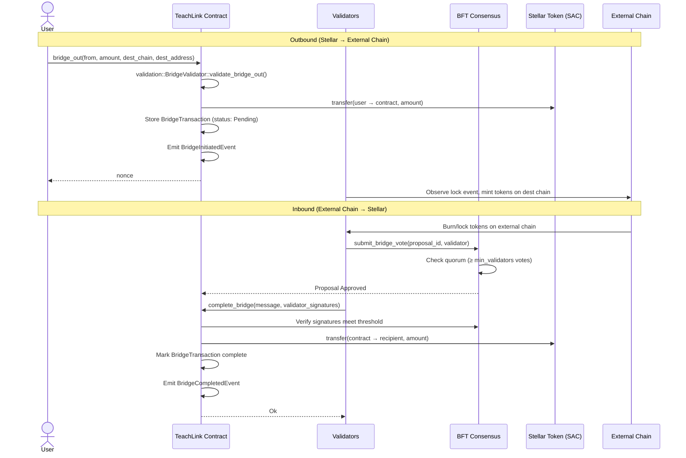
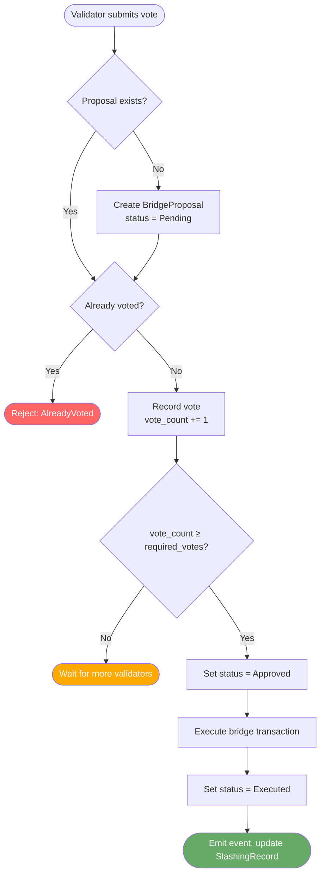
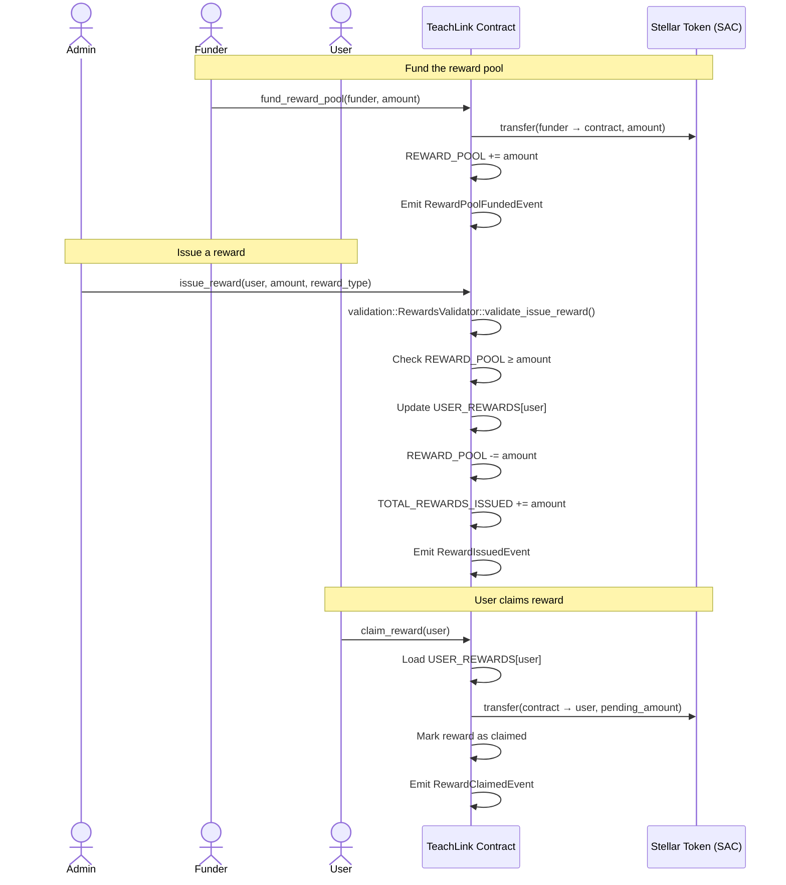
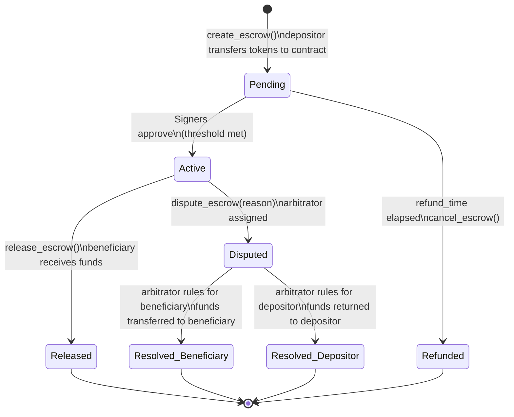
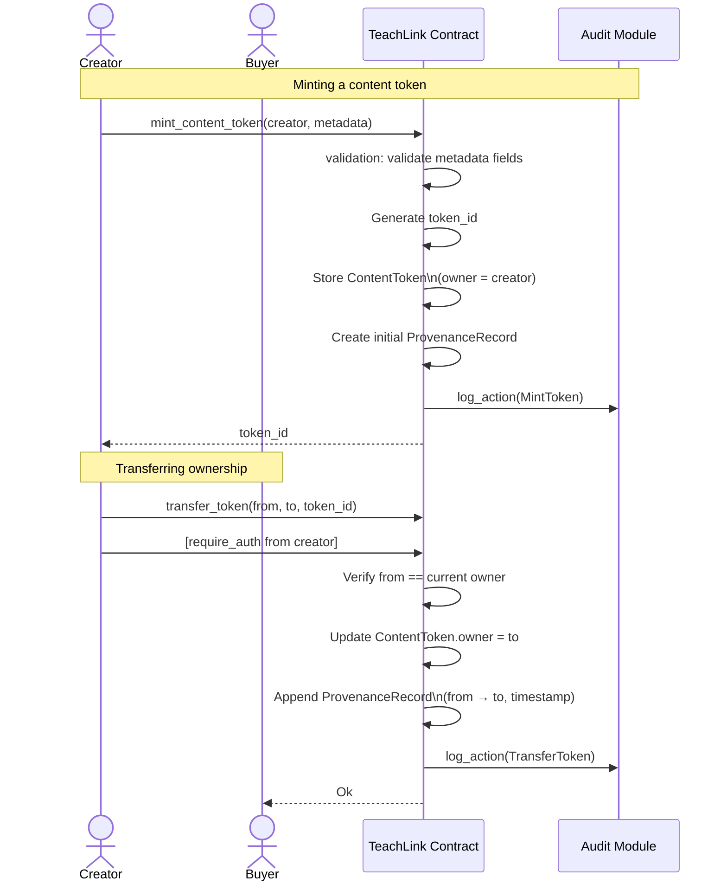
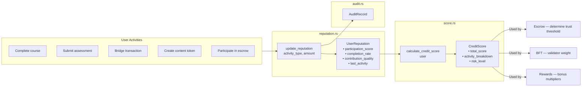
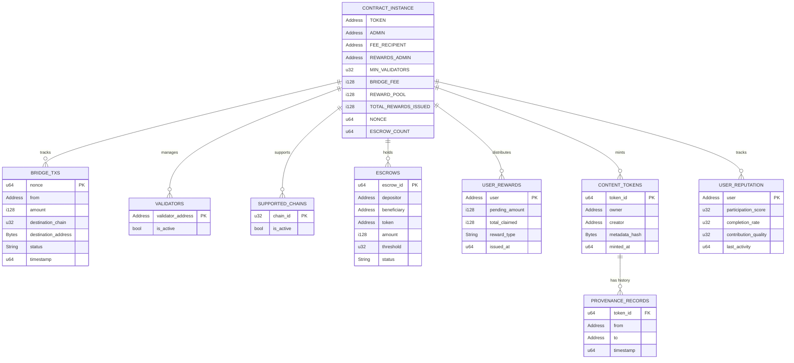

# TeachLink Architecture

This document describes the system architecture, component interactions, and data flows for the TeachLink decentralized knowledge-sharing platform built on the Stellar network using Soroban smart contracts.

---

## Table of Contents

- [High-Level System Architecture](#high-level-system-architecture)
- [Contract Module Map](#contract-module-map)
- [Component Interactions](#component-interactions)
- [Data Flow Diagrams](#data-flow-diagrams)
  - [Cross-Chain Bridge Flow](#cross-chain-bridge-flow)
  - [BFT Consensus Flow](#bft-consensus-flow)
  - [Rewards System Flow](#rewards-system-flow)
  - [Escrow Lifecycle Flow](#escrow-lifecycle-flow)
  - [Content Tokenization Flow](#content-tokenization-flow)
  - [Reputation & Credit Scoring Flow](#reputation--credit-scoring-flow)
- [Storage Model](#storage-model)

---

## High-Level System Architecture

This diagram shows the layers of the TeachLink platform from user-facing clients down to the Stellar network.

---

## Contract Module Map

All modules live inside the single `TeachLinkBridge` contract. They are organized into four functional groups.

---

## Component Interactions

This diagram shows how the major modules call each other at runtime.

---

## Data Flow Diagrams

### Cross-Chain Bridge Flow

Describes the full lifecycle of a cross-chain token transfer from Stellar to an external chain and back.

---

### BFT Consensus Flow

Shows how validators reach Byzantine Fault Tolerant consensus before a bridge proposal is executed.

---

### Rewards System Flow

Describes how the reward pool is funded and how rewards are issued and claimed by users.

---

### Escrow Lifecycle Flow

Shows all paths through a multi-signature escrow: normal release, timeout refund, and dispute resolution.

---

### Content Tokenization Flow

Describes how educational content is minted as an NFT and transferred with full provenance tracking.

---

### Reputation & Credit Scoring Flow

Shows how user activity is tracked and converted into a reputation score and credit score.

---

## Storage Model

The contract uses Soroban's instance and persistent storage. Key storage entries are defined in `storage.rs`.

---

## Keeping Diagrams Updated

When making changes to the contract, update the relevant diagram(s) in this file:

| Change type | Diagram to update |
|---|---|
| New module added | Contract Module Map, Component Interactions |
| New bridge flow or validator logic | Cross-Chain Bridge Flow, BFT Consensus Flow |
| Escrow state change | Escrow Lifecycle Flow |
| New reward type | Rewards System Flow |
| New token operation | Content Tokenization Flow |
| New reputation activity | Reputation & Credit Scoring Flow |
| New storage key added | Storage Model |

All diagrams are written in [Mermaid](https://mermaid.js.org/) and render natively on GitHub.
