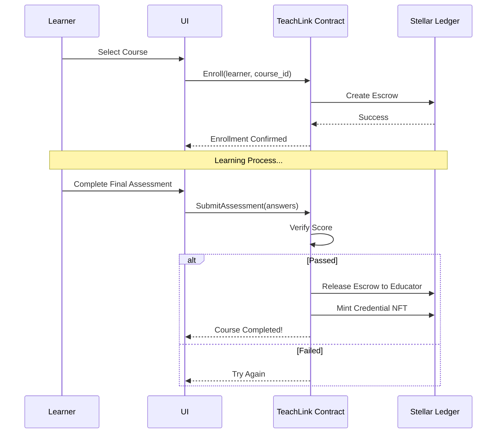
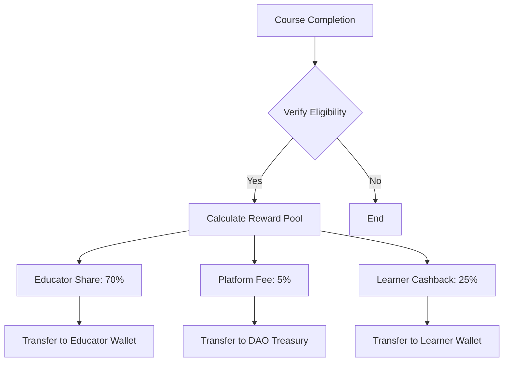
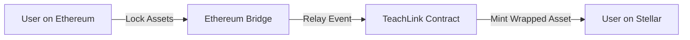

# System Flow Diagrams

This document visualizes the core processes within the TeachLink ecosystem using Mermaid diagrams.

## 🎓 Learner Journey

The process of a learner enrolling in a course and receiving a credential.

## 💰 Reward Distribution

How rewards are calculated and distributed to educators and learners.

## 🌉 Cross-Chain Bridge Flow

(Placeholder for cross-chain integration logic)

